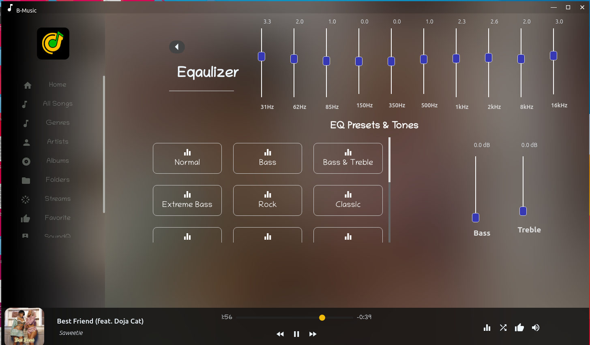
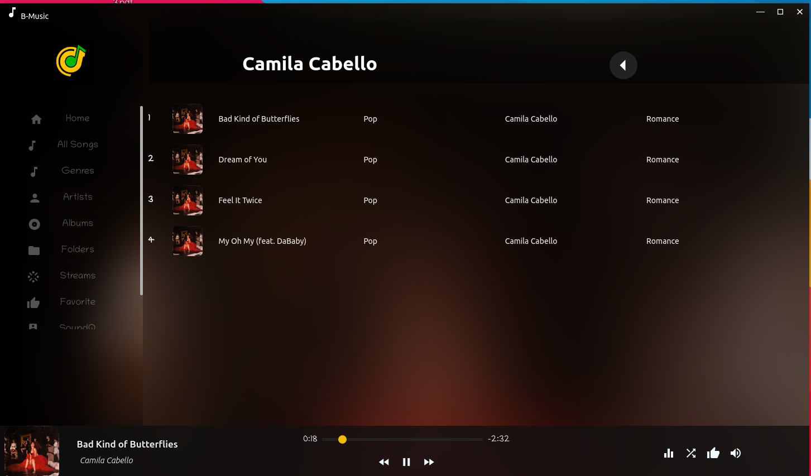
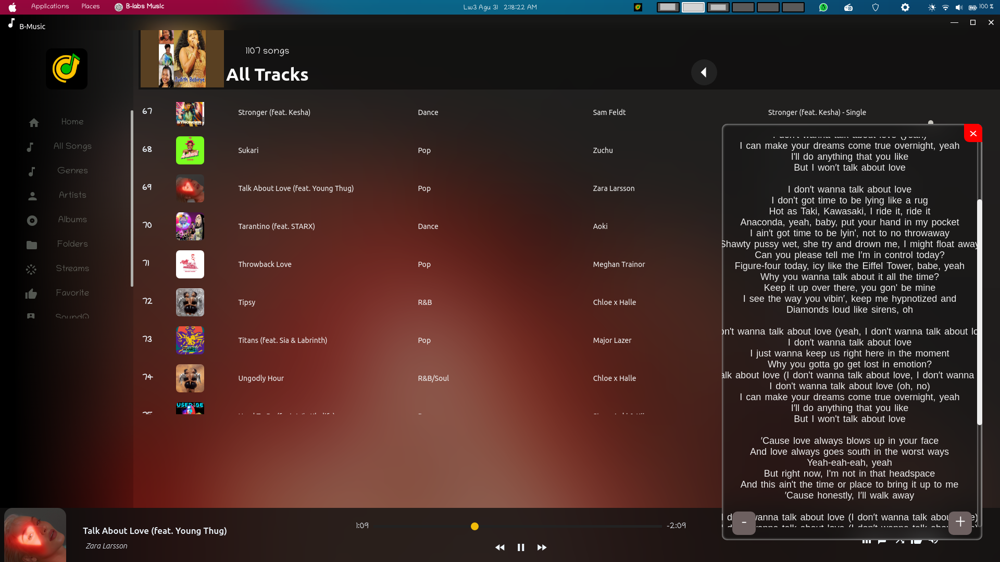

#  B-labs Musix 

### Current Features
- Loads songs from selected folders
- 10 Band Equalizer
- Next track widget
- Online lyrics
- Streaming music ( UG Music currently )
- Visualisers
- Room Effects (Scene , Small Room ,...)

* More features are coming......

## ScreenShots( Desktop )

 
 

## ToDo
- Enable or disable animations
- Change app theme
- Enable auto music Loading
  
## Tech Stack
- VueJs
- WebAudioApi
- Electronjs
- Nodejs
- ECMAScript
  